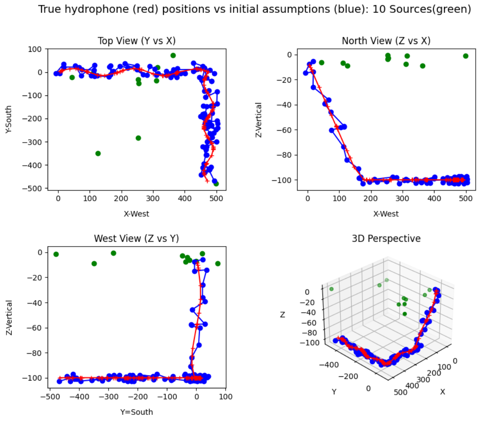
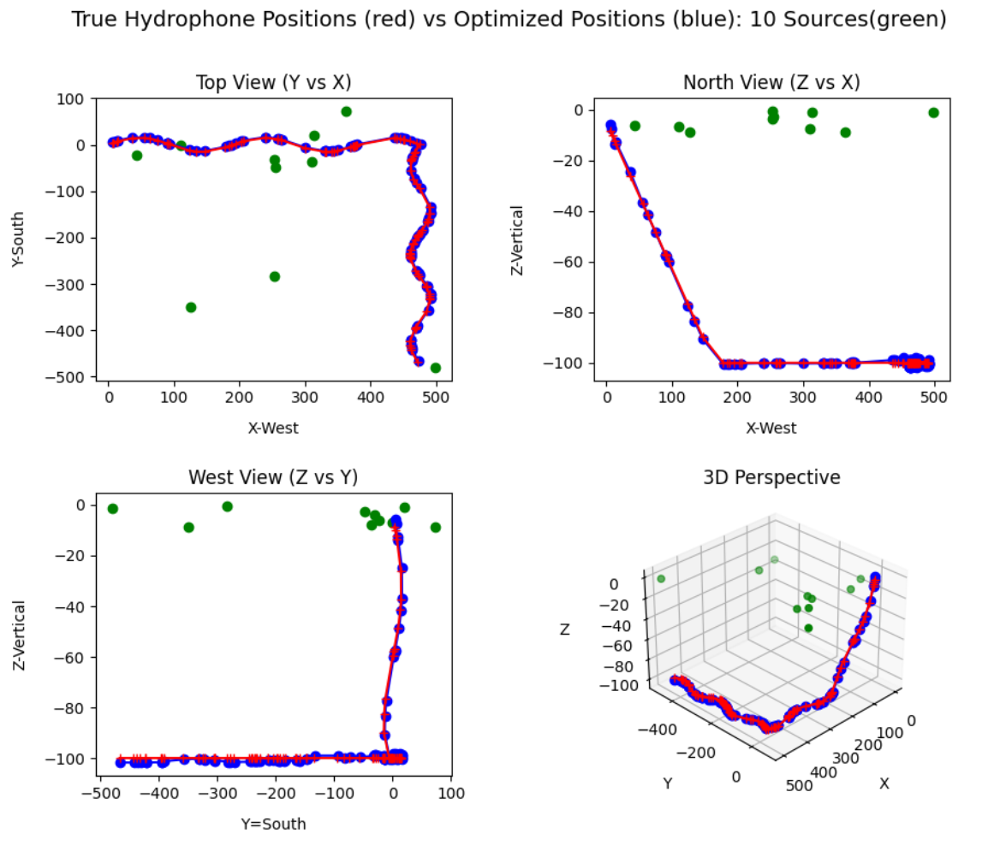

## These Python scripts create modeled DAS fibers and modeled arrival time differences for chosen sources.

### DAS_defineFiber.py   -----> outputs a binary (pickle) summary of the fiber

#### Here is an output for a "L" shaped fiber with 100 hydrophones randomly distributed along the fiber. The fiber descends at 30 degrees to a depth of 100 m and then turns "North"
#### The Blue dots are the initial assumed locations (randomly generated in the region of the 'actual' fiber) of the hydrophones while the actual (initially unknown in the real world) locations are in Red

### DAS_locateArray.py   -----> outputs plots and adds optimized hydrophone locations to the binary summary of the fiber, class DAS_line.

###  Now, with a fiber deployed, a number of sources are used at random points near the surface to 'Localize' the individual hydrophone elements
#### Red is the 'actual' (i.e. assumed fiber) and Blue is the located array after localization using a number of locating signals (Green).

####  This localization, with 100 hydrophones and 10 sources took some 80 seconds (stopping tolerance 1e-6) on my desktop. I don't know why there are large vertical fitting errors near the start of the fiber. Using some deeper localization sources would likely fix this.

### The localized fiber is then used to calculate source locations.

### DAS_locateSource.py

#### An assumed source is used to determine time differences recorded on the 'actual' fiber. This models what would be detected by the DAS.
#### Then time differences calculated with the source and the localized fiber are used to then localize the 'unknown' source
#### Calculated Source location is  [[501.04589546 -99.55370506  -1.29196534]]
#### Assumed source location is  [500, -100, 0]

## DAS_classes.py has a number of class and helper functions.
